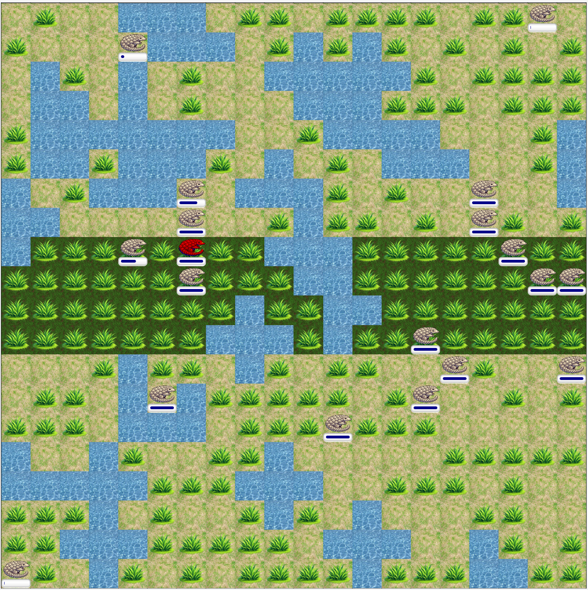
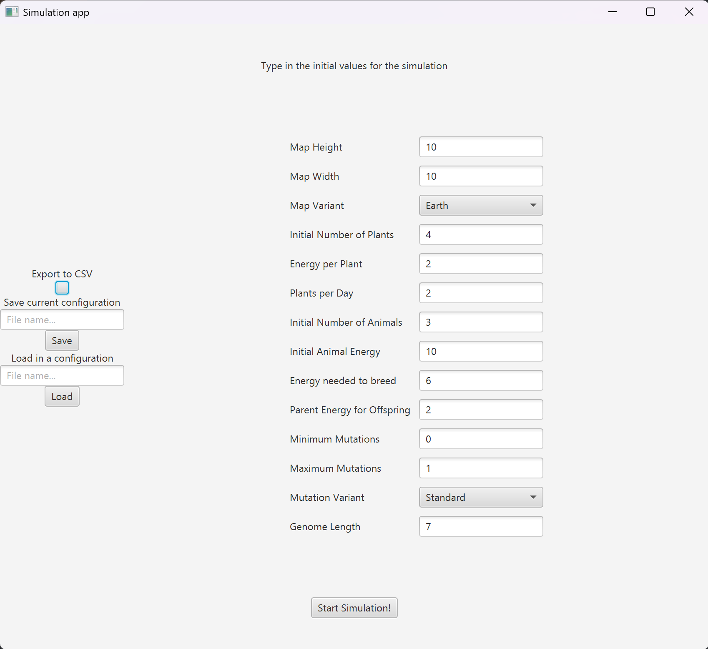

# Darwin Project

## Introduction
Darwin Poject is a Java-based desktop app that 
simulates an evolving ecosystem,
inspired by Charles Darwin’s theory of natural selection.
The application enables users to configure various 
simulation parameters, observe real-time changes in a
virtual ecosystem, and analyze statistical data.

This project was developed as part of the Object-Oriented
Programming course at AGH University of Science and Technology
in Kraków by:

- Michał Rejdak [[mrejdak]](https://github.com/mrejdak)
- Łukasz Krementowski [[Krzeselkoo]](https://github.com/Krzeselkoo)

Project guidelines (in Polish) are located
[here](https://github.com/mrejdak/DARWIN_PROJECT/tree/main/guidelines).
A variant C2 is implemented.

## About
This project simulates an evolving ecosystem populated 
by herbivorous animals that travel 
in search of food and mating opportunities to ensure 
species survival. Behavioral patterns and movement are
governed by genetically encoded instructions, which are
passed down from parents to offspring, enabling 
evolutionary development over generations.

The simulation world is a grid-based rectangular map
composed of square fields. The majority of the terrain
consists of steppes, characterized by low vegetation 
density. In contrast, designated jungle zones that ar located
on an equator support accelerated plant growth and higher
vegetation concentration. Plants appear randomly, 
but more frequently within the jungle region.

Each animal possesses an energy reserve that depletes daily.
Energy is replenished by consuming plants, and reproduction
is possible when an animal exceeds a specific energy 
threshold. The simulation evolves in daily cycles,
that include:

- Removal of dead animals

- Animal movement and orientation changes based on genetic behavior

- Plant consumption

- Breeding of animals meeting reproductive conditions and located on the same field

- Growth of new plants

This dynamic system allows users to observe how population changes over time and to track certain herbivores.

## Features
Various of the simulation parameters are highly customizable.

As a user, you can choose your own:
- map height and width
- map variant:
  - Earth - map simulating a globe, where the left and right edge of the map are connected (if an animal moves over the left edge, it will appear on the right end of the map and vice versa)
  - Tides - map simulating a world with ebbs and flows, on which every 4 days, there is a change between a low and high tide originating in random files that are the sources of water
- starting number of plants
- energy provided by consumption of a plant
- number of plants growing every day
- starting number of animals
- animals starting energy
- energy required to reproduce
- energy transferred from parent to offspring
- minimum and maximum number of mutations
- mutation variant:
  - Standard - mutation swaps one gene chosen randomly for another random gene
  - Switch-up - mutation has a chance to swap places of two randomly chosen genes
- length of an animal's genome

### Presets and saving statistics:
Presets can be both saved and loaded by user. They are located in the [config](https://github.com/mrejdak/DARWIN_PROJECT/tree/main/oolab/src/main/resources/configs) directory.
To save current preset, type a desired file name in the designated box and click **Save**. Loading a preset works in the same way.

There is also an option of saving the statistics to a csv file. To do so, simply click the **Export to CSV** tick-box. File containing logged statistics will be saved in [logs](https://github.com/mrejdak/DARWIN_PROJECT/tree/main/oolab/src/main/resources/logs).

## Visualization
The simulation displays current statistics and highlights animals with most popular genome (red coloured animals). It also allows for tracking a chosen animal.
To track an animal click the **Pause** button and click any file with animals. All animals present on that file will be displayed on the right. Then select the desired animal to track by clicking on it and click the **Resume** button.

Tracked animal will have a red border around the file it currently occupied and it's statistics will be displayed on the right. To stop tracking it choose another animal or click the **Stop tracking** button.
In case the tracked animal dies, there will be a message regarding the day it died.

